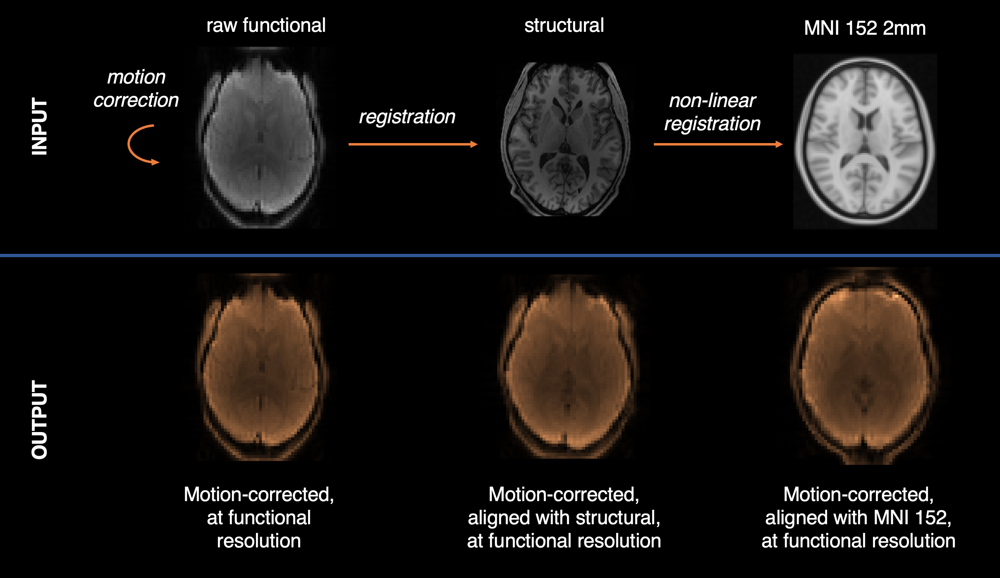

Regtricks 
=====================================

Tools for manipulating, combining and applying registrations. 

.. toctree::
   :maxdepth: 2
   :caption: Contents:
   :hidden: 

   Overview <self>
   quickstart
   fsl
   contributing
   Module index <modules> 
   genindex

============
What is it?
============

Regtricks is a python library that simplifies the process of working with and applying image registrations. **It is not** a replacement for image registration tools (eg FSL FLIRT), but it does make working with the output of these tools eaiser. It offers: 

* an **object oriented** interface: :class:`~regtricks.transforms.linear.Registration`, :class:`~regtricks.transforms.linear.MotionCorrection`, :class:`~regtricks.transforms.nonlinear.NonLinearRegistration` 
* easy **combining of multiple transforms** via :func:`~regtricks.multiplication.chain()`
* **one interpolation step** for image data, regardless of the number of transforms that need to be applied 
* **separation between transformation and interpolation**: generate a registration using one pair of images, then apply it to another, even if the voxel grids don't match 
* **full support** for FSL tools ``FLIRT``, ``MCFLIRT``, ``FNIRT``
* **intensity correction** via the Jacobian determinant for :class:`~regtricks.transforms.nonlinear.NonLinearRegistration`
* **multi-core support** for 4D images
* **lazy evaluation** avoids locking up your process until its time to actually transform an image 
* full **control over interpolation**, including order of spline interpolant and pre-filtering 
* an :class:`~regtricks.image_space.ImageSpace` **class for manipulating voxel grids** directly (eg cropping and supersampling)

============
Why?
============

Transformation, not interpolation 
-----------------------------------
Many registration tools (eg FSL) combine image *transformation* and *interpolation* into a single step, although they are **not** the same thing. 

A transformation moves an image so that it is aligned with some other image (eg, functional with structural). 
An interpolation redraws an image from one voxel grid onto another (eg, functional to structural resolution). 

What if you want to do one, but not the other? For example, transform a functional image into alignment with a structural, but leave the result in functional resolution? 
Regtricks separates the two operations from each other, allowing you to apply whatever transformations you want, and then choose which voxel grid in which to place the results. 

   Example usage of regtricks, showing the difference between transformation and interpolation. 
   From the images in the top row, three *transformations* are generated: a motion correction, a registration, and a non-linear registration. 
   On the bottom row, the transformations are applied, but the result is left *in the space of the original input* (functional resolution). 

Minimise interpolation
-----------------------
Regtricks allows multiple transformations to be combined with a **single** interpolation step. This preserves image quality by minimising interpolation-induced blurring. 

==================
How does it work?
==================

Transformations
-----------------

The subclasses of ``Transformation`` represent all the different types of registration: 

   * :class:`~regtricks.transforms.linear.Registration`: a linear affine registration (4x4 matrix) 
   * :class:`~regtricks.transforms.linear.MotionCorrection`: a linear motion correction (series of 4x4 matrices) 
   * :class:`~regtricks.transforms.nonlinear.NonLinearRegistration`: a non-linear registration (aka warp, only FSL FNIRT currently supported) 

All of these objects can be combined together, either via @ multiplication (NB reverse order, eg BC @ AB = AC), or *much* simpler: the :func:`~regtricks.multiplication.chain()` method!
For example, if you want to motion correct a functional image and register it onto a standard space in a single step::
   
   import regtricks as rt

   # Load MCFLIRT, FLIRT and FNIRT transformations for each step 
   func_mc = rt.MotionCorrection.from_mcflirt('func_mcf.mat', src='func.nii.gz', ref='func.nii.gz')
   func2struct = rt.Registration.from_flirt('func2struct.mat', src='func.nii.gz', ref='struct.nii.gz')
   struct2mni = rt.NonLinearRegistration.from_fnirt('struct2mni_coeff.nii.gz', src='struct.nii.gz', ref='mni.nii.gz')

   # Combine them into a single transformation that maps functional to MNI 
   func2mni_mc = rt.chain(func_mc, func2struct, struct2mni)

   # Apply them to get a nibabel NIFTI object back: 
   func_mni = func2mni_mc.apply_to_image('func.nii.gz', ref='mni.nii.gz') 
   nibabel.save(func_mni, 'func_mni.nii.gz')

Regtricks features *type promotion*. For example, if you chain a :class:`~regtricks.transforms.linear.Registration` and a :class:`~regtricks.transforms.linear.MotionCorrection` together, the result is a new :class:`~regtricks.transforms.linear.MotionCorrection`. This applies for all transform classes and requires no user action. 
All transform classes have an ``inverse()`` method that returns the self-inverse as a new object. 

Image spaces
-------------

All registration operations in regtricks are applied in two stages: 

1. apply a transformation to move the input image
2. write out the result on some voxel grid 

Although there is only a single way of doing step (1), there are many ways of doing step (2): do you want the result in the space 
of the input image, in the space of the target image, or in some other space entirely (eg MNI)? This is where the :class:`~regtricks.image_space.ImageSpace` class comes in.

The :class:`~regtricks.image_space.ImageSpace` class is used to represent the voxel grid of an image (ie, field of view, voxel size, position in world space). 
Although you probably won't need to interact with it directly, its handy to know why it exists. :class:`~regtricks.image_space.ImageSpace` are used to denote where image
data has come *from* and where it is going *to*. Almost all regtricks functions or classes accept a ``src`` and ``ref`` argument which represent the *from* and *to* respectively. 

Applying 
------------

Transformations are applied with the ``apply_to_image(src, ref)`` method, where ``src`` is the input image and ``ref`` is the space in which to place the output (which could be the same as ``src``). This function also accepts numerous extra arguments, for example: 

   - ``superfactor``: intermediate super-sampling factor (similar to FSL applywarp)
   - ``order``: order of spline interpolant, 1-5, default 3
   - ``cores``: multi-core processing to speed up 4D images 
   - ``**kwargs``: any args accepted by ``map_coordinates()``

Note that intensity correction via Jacobian determinants for non-linear transforms can be applied, but it must be set when creating a non-linear transform object, not when calling ``apply_to_image()``. For example::
   
   epi_distcorr = NonLinearRegistration(*, intensity_correct=True). 

Scipy's ``map_coordinates()`` is used to perform interpolation; this is a powerful tool that accepts many extra arguments (passed via ``**kwargs``). 

FSL Wrappers 
-------------

Wrappers for the standard FSL registration functions are available in ``regtricks.wrappers``. These behave slightly differently to normal
commandline tools in that they return transformation objects. For example: ``a_flirt = rt.wrappers.flirt(src, ref)`` will run FLIRT 
and output a :class:`~regtricks.transforms.linear.Registration` object directly. 

